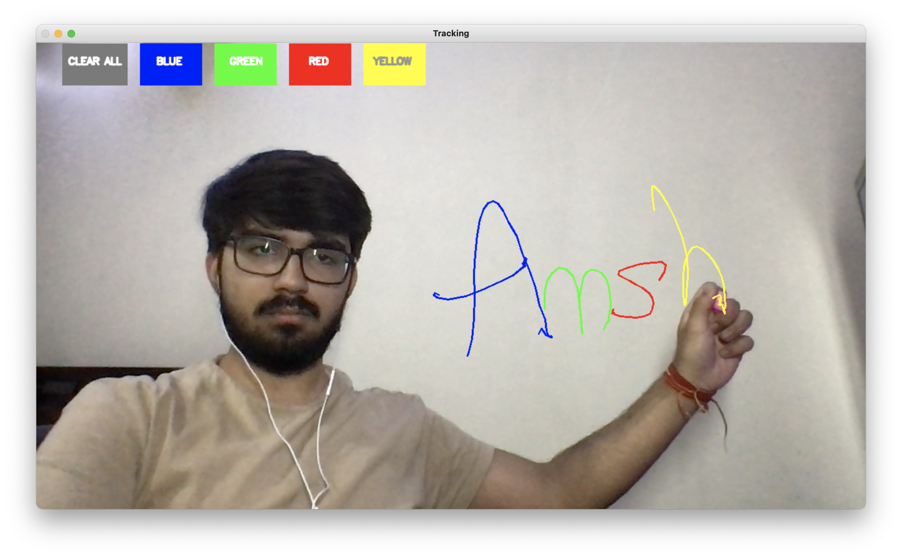
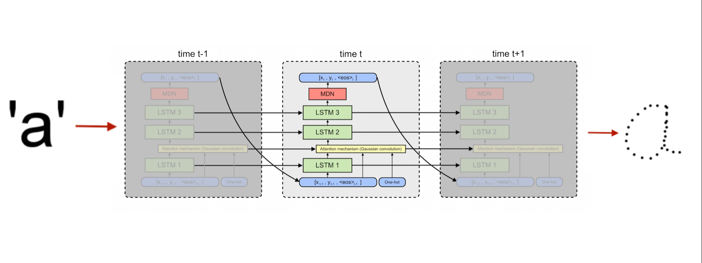
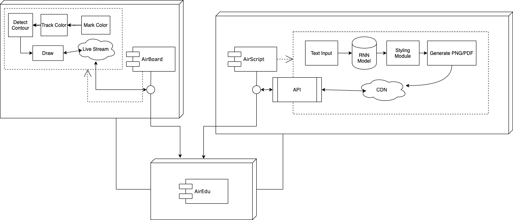
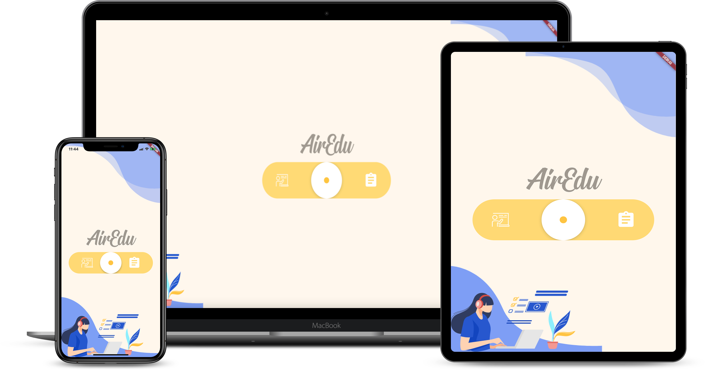

# AirEdu

A smart e-learning suite designed to improve e-learning experience and enhance student-teacher interaction.

# Airboard + AirScript = AirEdu ❤️

- ## AirBoard 👨‍🏫

Draw on a Board by waving finger in Air

- ## AirScript 

Generate Paperless document in your own handwriting. AirScript Uses RNN architecture inspired from the work of [Alex Graves](https://arxiv.org/pdf/1308.0850.pdf)

#### RNN Model:

#### Results:

- ## AirEdu 
A Flutter Cross-Platform Application to wrapping both the suites.

### System Architecture:

### Application:

---
